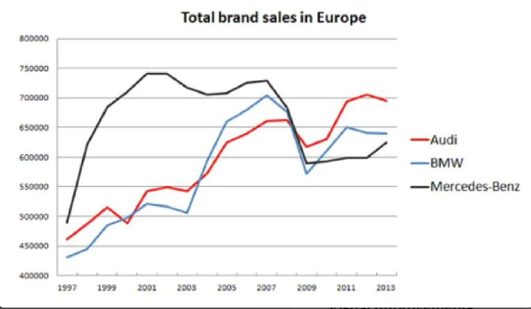

# Analysis of "Total brand sales in Europe" Graphic

## Original Graphic

---

## Checklist Evaluation

### Data Criteria

| # | Criterion | Pass? | Comment |
|---|-----------|-------|---------|
| 1 | Type of graphic adapted to nature of data | ✅ YES | Line graph is appropriate for time series data |
| 2 | Approximations/interpolation make sense | ✅ YES | Linear interpolation between years is reasonable |
| 3 | Curves defined by sufficient number of points | ✅ YES | Biennial data points appear sufficient |
| 4 | Building method of curve is clear | ⚠️ PARTIAL | Appears to be linear interpolation but not explicitly stated |
| 5 | Confidence intervals visualized | ❌ NO | No confidence intervals or error bars shown |
| 6 | Histogram steps are adequate | N/A | Not a histogram |
| 7 | Histograms visualize probabilities | N/A | Not a histogram |

### Graphical Objects

| # | Criterion | Pass? | Comment |
|---|-----------|-------|---------|
| 1 | Objects readable on screen/print/B&W | ❌ NO | Red and blue may be difficult to distinguish in B&W |
| 2 | Standard color range, no problematic colors | ✅ YES | Colors are standard  |
| 3 | Graphical axes well identified and labelled | ❌ NO | Y-axis has no label describing what is measured |
| 4 | Scales and units explicit | ⚠️ PARTIAL | Y-axis numbers visible but no unit label (cars? thousands?) |
| 5 | Curves cross without ambiguity | ✅ YES | Crossings are generally clear |
| 6 | Grids help the reader | ✅ YES | Horizontal gridlines aid reading values |

### Annotations (Part 1)

| # | Criterion | Pass? | Comment |
|---|-----------|-------|---------|
| 1 | Axes labelled by quantities | ⚠️ PARTIAL | X-axis shows years, Y-axis shows numbers without context |
| 2 | Labels clear and self-contained | ❌ NO | Y-axis has no descriptive label |
| 3 | Units indicated on axes | ❌ NO | No units specified (units of sales? thousands? millions?) |
| 4 | Axes oriented left-to-right, bottom-to-top | ✅ YES | Standard orientation |
| 5 | Origin is (0,0) or justified | ❌ NO | Y-axis starts at 400,000, not justified or indicated clearly |
| 6 | No holes on axes | ✅ YES | Continuous axis representation |

### Annotations (Part 2)

| # | Criterion | Pass? | Comment |
|---|-----------|-------|---------|
| 6 | Bar order based on classical ordering | N/A | Not a bar graph |
| 7 | Each curve has a legend | ✅ YES | Legend clearly identifies all three brands |
| 8 | Each bar has a legend | N/A | Not a bar graph |

### Information

| # | Criterion | Pass? | Comment |
|---|-----------|-------|---------|
| 1 | Curves on same scale | ✅ YES | All curves use the same Y-axis |
| 2 | Number of curves small (< 6) | ✅ YES | Only 3 curves shown |
| 3 | Compare curves on same graphic | ✅ YES | Comparison is the purpose of the graphic |
| 4 | No removable curve without losing information | ✅ YES | Each brand provides unique information |
| 5 | Graphic gives relevant information | ✅ YES | Shows comparative sales trends over time |
| 6 | Vertical axis shows error bars for averages | ❌ NO | No error bars |
| 7 | No removable object without affecting readability | ✅ YES | All elements serve a purpose |

### Context

| # | Criterion | Pass? | Comment |
|---|-----------|-------|---------|
| 1 | Symbols defined and referenced in text | ❌ NO | No accompanying text provided |
| 2 | Graphic produces more info than other representations | ✅ YES | Visual trend comparison is effective |
| 3 | Graphic has a title | ✅ YES | "Total brand sales in Europe" |
| 4 | Title sufficiently self-contained | ⚠️ PARTIAL | Lacks information about units and specific data type |
| 5 | Graphic referenced in text | ❌ NO | No text context provided |
| 6 | Text comments the figure | ❌ NO | No accompanying text |

---

## Summary of Issues

### Critical Problems:
- **No Y-axis label**: Unclear what is being measured
- **No units specified**: Are these cars sold? Thousands? Millions?
- **Y-axis doesn't start at zero**: Creates visual distortion without explanation

### Minor Issues:
- No confidence intervals or error indicators
- Title could be more descriptive
- No accompanying text or context
- Interpolation method not specified