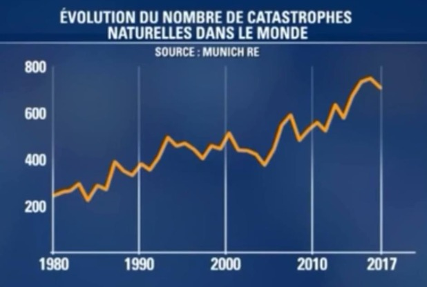

# Analysis of "Evolution du nombre de catastrophes naturelles dans le monde" Graphic

## Original Graphic

---

## Checklist Evaluation

### Data Criteria

| # | Criterion | Pass? | Comment |
|---|-----------|-------|---------|
| 1 | Type of graphic adapted to nature of data | ✅ YES | Line graph is appropriate for time series data |
| 2 | Approximations/interpolation make sense | ✅ YES | Linear interpolation appears reasonable for this type of data |
| 3 | Curves defined by sufficient number of points | ✅ YES | Sufficient data points visible across the time period |
| 4 | Building method of curve is clear | ⚠️ PARTIAL | Appears to be linear interpolation but not explicitly stated |
| 5 | Confidence intervals visualized | ❌ NO | No confidence intervals or error bars shown |
| 6 | Histogram steps are adequate | N/A | Not a histogram |
| 7 | Histograms visualize probabilities | N/A | Not a histogram |

### Graphical Objects

| # | Criterion | Pass? | Comment |
|---|-----------|-------|---------|
| 1 | Objects readable on screen/print/B&W | ❌ NO | Orange on dark blue background will be illegible in B&W |
| 2 | Standard color range, no problematic colors | ❌ NO | Dark blue background is non-standard and reduces readability |
| 3 | Graphical axes well identified and labelled | ❌ NO | No axis labels, only title |
| 4 | Scales and units explicit | ❌ NO | No Y-axis label, unclear what unit is measured |
| 5 | Curves cross without ambiguity | N/A | Only one curve |
| 6 | Grids help the reader | ⚠️ PARTIAL | Vertical gridlines present but difficult to see, no horizontal gridlines |

### Annotations (Part 1)

| # | Criterion | Pass? | Comment |
|---|-----------|-------|---------|
| 1 | Axes labelled by quantities | ❌ NO | X-axis shows years, Y-axis has no label |
| 2 | Labels clear and self-contained | ❌ NO | No Y-axis descriptive label |
| 3 | Units indicated on axes | ❌ NO | Y-axis numbers without units or description |
| 4 | Axes oriented left-to-right, bottom-to-top | ✅ YES | Standard orientation |
| 5 | Origin is (0,0) or justified | ✅ YES | Y-axis starts at 0 , X-axis starts at 1980 but is is justfiable as the graph measures starting from a certain year |
| 6 | No holes on axes | ⚠️ PARTIAL | X-axis appears continuous but spacing unclear |

### Annotations (Part 2)

| # | Criterion | Pass? | Comment |
|---|-----------|-------|---------|
| 6 | Bar order based on classical ordering | N/A | Not a bar graph |
| 7 | Each curve has a legend | N/A | Only one curve, no legend needed but nature of data unclear |
| 8 | Each bar has a legend | N/A | Not a bar graph |

### Information

| # | Criterion | Pass? | Comment |
|---|-----------|-------|---------|
| 1 | Curves on same scale | N/A | Only one curve |
| 2 | Number of curves small (< 6) | ✅ YES | Only 1 curve shown |
| 3 | Compare curves on same graphic | N/A | Only one curve |
| 4 | No removable curve without losing information | ✅ YES | Single curve contains all information |
| 5 | Graphic gives relevant information | ✅ YES | Shows trend in natural catastrophes over time |
| 6 | Vertical axis shows error bars for averages | ❌ NO | No error bars or uncertainty indicators |
| 7 | No removable object without affecting readability | ⚠️ PARTIAL | Dark background is unnecessary and reduces readability |

### Context

| # | Criterion | Pass? | Comment |
|---|-----------|-------|---------|
| 1 | Symbols defined and referenced in text | ❌ NO | No accompanying text provided |
| 2 | Graphic produces more info than other representations | ✅ YES | Visual trend is effective |
| 3 | Graphic has a title | ✅ YES | "Evolution du nombre de catastrophes naturelles dans le monde" |
| 4 | Title sufficiently self-contained | ⚠️ PARTIAL | Good title but lacks information about methodology or definition |
| 5 | Graphic referenced in text | ❌ NO | No text context provided |
| 6 | Text comments the figure | ❌ NO | No accompanying text |

---

## Summary of Issues

### Critical Problems:
- **Poor color scheme**: Orange on dark blue background creates readability issues
- **No Y-axis label**: Unclear what exactly is being counted (number of events? severity index?)
- **Illegible in B&W**: Would be completely unreadable if printed in black and white
- **No definition of "catastrophe"**: What threshold or criteria define a natural catastrophe?
- **Unclear data granularity**: Are these annual totals? Moving averages?

### Minor Issues:
- No confidence intervals or error indicators
- Dark background reduces professional appearance and printability
- Gridlines are too subtle and difficult to see
- X-axis irregular spacing (1980, 1990, 2000, 2010, 2017)