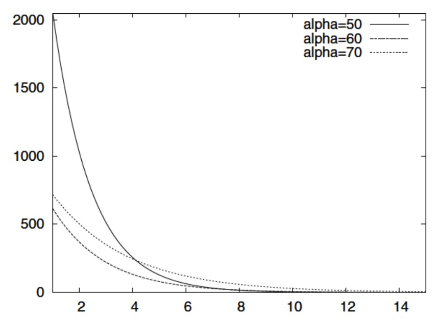

# Analysis of Alpha Parameter Curves Graphic

## Original Graphic

---

## Checklist Evaluation

### Data Criteria

| # | Criterion | Pass? | Comment |
|---|-----------|-------|---------|
| 1 | Type of graphic adapted to nature of data | ✅ YES | Line graph is appropriate for continuous function visualization |
| 2 | Approximations/interpolation make sense | ✅ YES | Smooth curves appear appropriate for mathematical functions |
| 3 | Curves defined by sufficient number of points | ✅ YES | Curves appear smooth with sufficient resolution |
| 4 | Building method of curve is clear | ❌ NO | Not specified whether these are calculated functions, measured data, or simulations |
| 5 | Confidence intervals visualized | ❌ NO | No confidence intervals shown (may not be applicable for deterministic functions) |
| 6 | Histogram steps are adequate | N/A | Not a histogram |
| 7 | Histograms visualize probabilities | N/A | Not a histogram |

### Graphical Objects

| # | Criterion | Pass? | Comment |
|---|-----------|-------|---------|
| 1 | Objects readable on screen/print/B&W | ✅ YES | Different line styles (solid, dashed, dotted) work well in B&W |
| 2 | Standard color range, no problematic colors | ✅ YES | Black and white, universally readable |
| 3 | Graphical axes well identified and labelled | ❌ NO | No axis labels at all |
| 4 | Scales and units explicit | ❌ NO | No labels or units on either axis |
| 5 | Curves cross without ambiguity | ✅ YES | Curves are clearly distinguishable |
| 6 | Grids help the reader | ❌ NO | No gridlines present, making value reading difficult |

### Annotations (Part 1)

| # | Criterion | Pass? | Comment |
|---|-----------|-------|---------|
| 1 | Axes labelled by quantities | ❌ NO | No labels on X or Y axis |
| 2 | Labels clear and self-contained | ❌ NO | No axis labels provided |
| 3 | Units indicated on axes | ❌ NO | No units specified on either axis |
| 4 | Axes oriented left-to-right, bottom-to-top | ✅ YES | Standard orientation |
| 5 | Origin is (0,0) or justified | ✅ YES | X-axis & Y-axis both starts at 0 |
| 6 | No holes on axes | ✅ YES | Continuous axis representation |

### Annotations (Part 2)

| # | Criterion | Pass? | Comment |
|---|-----------|-------|---------|
| 6 | Bar order based on classical ordering | N/A | Not a bar graph |
| 7 | Each curve has a legend | ✅ YES | Clear legend showing alpha=50, 60, 70 |
| 8 | Each bar has a legend | N/A | Not a bar graph |

### Information

| # | Criterion | Pass? | Comment |
|---|-----------|-------|---------|
| 1 | Curves on same scale | ✅ YES | All curves use the same axes |
| 2 | Number of curves small (< 6) | ✅ YES | Only 3 curves shown |
| 3 | Compare curves on same graphic | ✅ YES | Comparison of different alpha values is the purpose |
| 4 | No removable curve without losing information | ✅ YES | Each curve shows effect of different alpha parameter |
| 5 | Graphic gives relevant information | ⚠️ PARTIAL | Shows trends but without context it's unclear what the information means |
| 6 | Vertical axis shows error bars for averages | N/A | Appears to be deterministic functions, not averages |
| 7 | No removable object without affecting readability | ✅ YES | All elements serve a purpose |

### Context

| # | Criterion | Pass? | Comment |
|---|-----------|-------|---------|
| 1 | Symbols defined and referenced in text | ❌ NO | "Alpha" parameter not defined, no accompanying text |
| 2 | Graphic produces more info than other representations | ✅ YES | Visual comparison of parameter effects is effective |
| 3 | Graphic has a title | ❌ NO | No title provided |
| 4 | Title sufficiently self-contained | ❌ NO | No title at all |
| 5 | Graphic referenced in text | ❌ NO | No text context provided |
| 6 | Text comments the figure | ❌ NO | No accompanying text |

---

## Summary of Issues

### Critical Problems:
- **No title**: Graphic has no title explaining what is being shown
- **No axis labels**: Neither X-axis nor Y-axis has labels describing what quantities are being plotted
- **No units**: Impossible to know what units the numbers represent
- **No context**: "Alpha" parameter is not defined - what does it represent?
- **No gridlines**: Difficult to read specific values from the curves

### Minor Issues:
- No explanation of the relationship being shown
- Legend could specify what alpha represents
