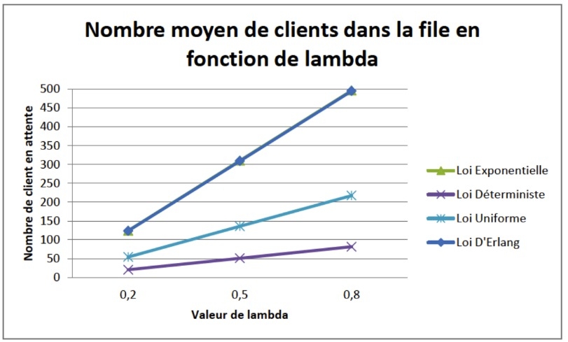

# Analysis of "Nombre moyen de clients dans la file en fonction de lambda" Graphic

## Original Graphic

---

## Checklist Evaluation

### Data Criteria

| # | Criterion | Pass? | Comment |
|---|-----------|-------|---------|
| 1 | Type of graphic adapted to nature of data | ✅ YES | Line graph appropriate for showing relationship between variables |
| 2 | Approximations/interpolation make sense | ⚠️ PARTIAL | Linear interpolation between 3 points may not accurately represent theoretical curves |
| 3 | Curves defined by sufficient number of points | ❌ NO | Only 3 data points per curve - insufficient for smooth representation |
| 4 | Building method of curve is clear | ❌ NO | Unclear if these are theoretical values, simulations, or measurements |
| 5 | Confidence intervals visualized | ❌ NO | No confidence intervals or error bars shown |
| 6 | Histogram steps are adequate | N/A | Not a histogram |
| 7 | Histograms visualize probabilities | N/A | Not a histogram |

### Graphical Objects

| # | Criterion | Pass? | Comment |
|---|-----------|-------|---------|
| 1 | Objects readable on screen/print/B&W | ⚠️ PARTIAL | Colors may be difficult to distinguish in B&W; line styles not differentiated |
| 2 | Standard color range, no problematic colors | ✅ YES | Standard color palette used |
| 3 | Graphical axes well identified and labelled | ✅ YES | Both axes have clear labels |
| 4 | Scales and units explicit | ⚠️ PARTIAL | Y-axis labeled but lambda appears dimensionless (no unit specified) |
| 5 | Curves cross without ambiguity | ✅ YES | Curves don't cross, clearly distinguishable |
| 6 | Grids help the reader | ✅ YES | Horizontal gridlines aid in reading values |

### Annotations (Part 1)

| # | Criterion | Pass? | Comment |
|---|-----------|-------|---------|
| 1 | Axes labelled by quantities | ✅ YES | X-axis: "Valeur de lambda", Y-axis: "Nombre de client en attente" |
| 2 | Labels clear and self-contained | ✅ YES | Labels are clear and descriptive |
| 3 | Units indicated on axes | ⚠️ PARTIAL | Y-axis unit is "clients" (implicit), lambda appears dimensionless |
| 4 | Axes oriented left-to-right, bottom-to-top | ✅ YES | Standard orientation |
| 5 | Origin is (0,0) or justified | ✅ YES | X-axis & Y-axis both starts at 0 |
| 6 | No holes on axes | ✅ YES | Continuous axis representation |

### Annotations (Part 2)

| # | Criterion | Pass? | Comment |
|---|-----------|-------|---------|
| 6 | Bar order based on classical ordering | N/A | Not a bar graph |
| 7 | Each curve has a legend | ✅ YES | Clear legend identifying all four curves |
| 8 | Each bar has a legend | N/A | Not a bar graph |

### Information

| # | Criterion | Pass? | Comment |
|---|-----------|-------|---------|
| 1 | Curves on same scale | ✅ YES | All curves use the same axes |
| 2 | Number of curves small (< 6) | ✅ YES | 4 curves shown |
| 3 | Compare curves on same graphic | ✅ YES | Comparison of different queueing laws is the purpose |
| 4 | No removable curve without losing information | ✅ YES | Each curve represents a different queueing model |
| 5 | Graphic gives relevant information | ✅ YES | Shows how different models behave with varying lambda |
| 6 | Vertical axis shows error bars for averages | ❌ NO | No error bars (may be theoretical values) |
| 7 | No removable object without affecting readability | ✅ YES | All elements serve a purpose |

### Context

| # | Criterion | Pass? | Comment |
|---|-----------|-------|---------|
| 1 | Symbols defined and referenced in text | ❌ NO | "Lambda" not defined, queueing laws not explained |
| 2 | Graphic produces more info than other representations | ✅ YES | Visual comparison of models is effective |
| 3 | Graphic has a title | ✅ YES | Clear title describing the content |
| 4 | Title sufficiently self-contained | ⚠️ PARTIAL | Good title but lacks context about what "lambda" represents |
| 5 | Graphic referenced in text | ❌ NO | No text context provided |
| 6 | Text comments the figure | ❌ NO | No accompanying text |

---

## Summary of Issues

### Critical Problems:
- **Insufficient data points**: Only 3 points per curve creates misleading linear segments instead of showing true curve behavior
- **No definition of lambda**: Parameter not defined (arrival rate? service rate? utilization?)
- **No explanation of queueing laws**: Terms like "Loi Exponentielle", "Loi Déterministe", etc. not defined
- **Poor B&W readability**: All curves use similar line styles, difficult to distinguish without color

### Minor Issues:
- No units specified for lambda
- Green curve ("Loi Exponentielle") not visible - possibly missing or overlapping
