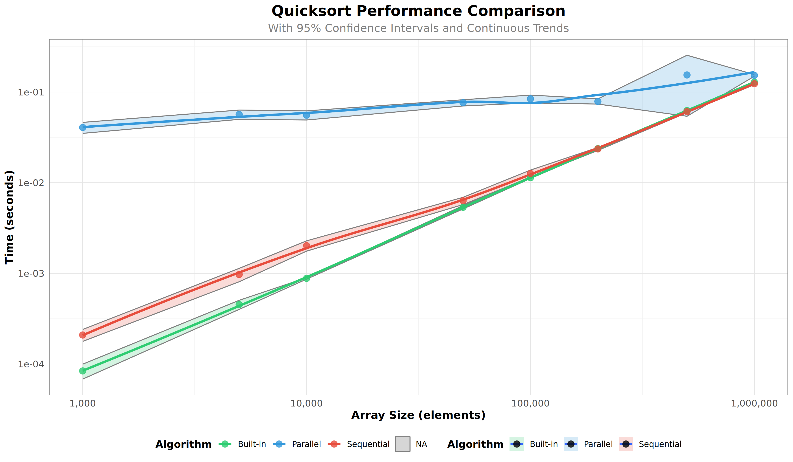

# Assignment 1: Improving Experimental Methodology in Parallel Quicksort Analysis

## Overview

This assignment involves re-running and improving the experimental methodology of a parallel quicksort performance comparison project. The goal is to demonstrate how rigorous experimental design leads to more reliable and statistically sound results.

The project compares the performance of three sorting algorithms:
- **Sequential Quicksort** (single-threaded custom implementation)
- **Parallel Quicksort** (multi-threaded custom implementation)
- **Built-in qsort** (C standard library implementation)

## Original Limitations

The original experimental design had several methodological issues that undermined statistical validity:

### 1. **Only 5 Repetitions (Insufficient for Statistical Significance)**
- **Problem:** 5 measurements per configuration is too small. A single slow run due to system noise, cache effects, or background processes can significantly skew the average.
- **Statistical Impact:** Cannot reliably calculate confidence intervals; results lack robustness.
- **Example:** If one of 5 runs is 2x slower due to system interference, the average is corrupted.

### 2. **Limited Array Sizes with Large Gaps**
- **Original sizes:** 100, 1,000, 10,000, 100,000, 1,000,000 (exponential jumps of 10x)
- **Problem:** Large gaps between measurements make it impossible to see intermediate behavior. Critical information is missed—for example, we cannot determine the exact array size threshold where parallel becomes faster than sequential.
- **Impact:** Coarse-grained analysis; smooth trends cannot be accurately estimated.

### 3. **No System Stabilization Between Runs**
- **Problem:** Consecutive runs without delays cause CPU cache to remain hot, thermal conditions to accumulate, and system state to be non-independent.
- **Impact:** Measurements are not truly independent; results are biased and harder to interpret statistically.

## Improvements Implemented

### 1. **Increased to 30 Repetitions**
```bash
for rep in `seq 1 30`; do
    ./src/parallelQuicksort $i >> $OUTPUT_FILE;
done
```
- **Benefit:** Better statistical reliability with more samples.
- **Enables:** Calculation of robust confidence intervals and better noise filtering.

### 2. **Expanded to 8 Array Sizes with Finer Granularity**
```bash
for i in 1000 5000 10000 50000 100000 200000 500000 1000000; do
```
- **Benefit:** More intermediate points allow detection of performance crossover points and smoother trend estimation.
- **Trade-off:** Runtime scales reasonably .

### 3. **Added 1-Second Sleep Between Runs**
```bash
./src/parallelQuicksort $i >> $OUTPUT_FILE;
sleep 1;  # Allow CPU to cool down
```
- **Benefit:** Reduces system interference and thermal effects; measurements become more independent.
- **Impact:** Cleaner, more consistent timing data.

## Project Structure

```
assignment1-quicksort/
├── README.md                          (this file)
├── src/
│   ├── parallelQuicksort.c           (main implementation)
│   └── Makefile
├── scripts/
│   ├── run_benchmarking.sh            (improved benchmark script)
│   └── (original scripts for reference)
├── data/
│   └── [hostname]_[date]/
│       ├── measurements_[time].txt    (raw measurements)
│       └── performance_analysis_final.png  (final plot)
└── analysis.R                         (ggplot2 analysis script)
```

## Usage

### Setup

1. **Compile the code:**
   ```bash
   make -C src/
   ```

2. **Install R dependencies (once):**
   ```bash
   sudo Rscript -e "install.packages(c('ggplot2', 'dplyr'))"
   ```

### Run Full Pipeline

```bash
# 1. Compile
make -C src/

# 2. Run improved benchmarks (takes ~5 minutes)
bash scripts/run_benchmarking.sh

# 3. Analyze results with ggplot2
Rscript analysis.R

# 4. View results
# Open data/[hostname]_[date]/performance_analysis_final.png
```

Or all at once:
```bash
make -C src/ && bash scripts/run_benchmarking.sh && Rscript analysis.R
```

### Quick Test (Smaller Scope)

To test the pipeline with fewer data points:
```bash
# Modify scripts/run_benchmarking_improved.sh:
# Change: for i in 1000 5000 10000 50000 100000 200000 500000 1000000; do
# To:     for i in 10000 100000 1000000; do
# And:    for rep in `seq 1 5`; do

bash scripts/run_benchmarking_improved.sh && Rscript analysis.R
```

## Analysis & Results

### Final Visualization



*Figure: Performance comparison of three quicksort implementations with 95% confidence intervals (shaded bands) and continuous trend lines fitted using LOESS regression.*

### Statistical Methods Applied

The improved analysis includes:

1. **Confidence Intervals (95%)**
   - Shaded bands around each data point show the uncertainty range
   - If intervals don't overlap between algorithms, the difference is statistically significant

2. **Continuous Trend Lines**
   - Smooth curves (LOESS regression) fitted through the data with their own confidence bands
   - Reveals underlying performance patterns beyond individual measurement noise
   - Enables visual identification of performance crossover points
   - Note: The confidence bands reflect the uncertainty in the fitted curve itself, not the raw measurement variability

3. **Logarithmic Scaling**
   - Both X-axis (array size) and Y-axis (execution time) use logarithmic scale
   - **Rationale:** Quicksort has O(n log n) complexity, meaning execution time grows proportionally to n × log(n). On a log-log plot, this appears as a straight line with slope ≈ 1, making performance trends easier to visualize and compare across multiple orders of magnitude (from 1,000 to 1,000,000 elements)
   - Makes it easier to identify deviations from expected algorithmic complexity

### Expected Findings

The analysis should reveal:
- **Built-in qsort** performs consistently well across all sizes
- **Parallel quicksort** shows overhead at small sizes, potentially becomes competitive at larger sizes
- **Sequential quicksort** provides a baseline for comparison
- **Confidence intervals** show where measurements are reliable vs. noisy

## Technical Details

### Data Collection
- **Algorithm:** Modified version of Joshua Stough's parallel quicksort implementation (Washington and Lee University)
- **Languages:** C (sorting implementation), Bash (benchmarking), R (analysis)
- **System Requirements:** Linux/WSL, gcc, R with ggplot2 and dplyr

### Analysis Pipeline
1. Raw timing data → Measurements file
2. Parse and aggregate with mean, std dev, confidence intervals
3. Fit smooth trend lines using LOESS regression
4. Visualize with ggplot2

## References

- Original implementation: https://github.com/alegrand/M2R-ParallelQuicksort
- Laboratory notebook framework: Arnaud Legrand's M2R-ParallelQuicksort project
- R visualization: ggplot2 documentation